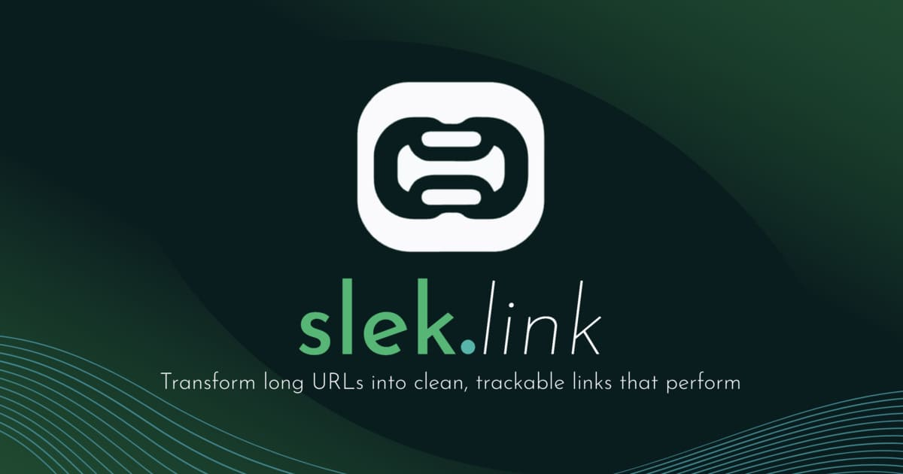

# slek-link

A fast, free, and easy-to-use URL shortener with built-in analytics for tracking clicks by country and month.

 

## Features

- 🚀 **Fast & Scalable** – Built with Go for lightning-fast URL redirection and high traffic handling.
- 🎨 **Simple & Intuitive** – Easy-to-use interface for shortening and tracking links.
- 📊 **Detailed Analytics** – Track **monthly clicks** and **country-wise engagement** with clear graphs.
- 💸 **100% Free** – No sign-ups or subscriptions—just shorten and share!
- 🔒 **Secure & Reliable** – Protects links from tampering with a robust backend.

## Technologies Used

- **Webapp**: [Go](https://go.dev/) with [Go Templ](https://templ.guide/) and [Datastar](https://data-star.dev/)
- **Styling**: [Tailwind CSS](https://tailwindcss.com/) with [DaisyUI](https://daisyui.com/)
- **Persistence**: [PostgreSQL](https://www.postgresql.org/) with [GORM](https://gorm.io/)
- **Event Handling**: [RabbitMQ](https://www.rabbitmq.com/) with [AsyncAPI](https://www.asyncapi.com/)
- **Performance**: [Valkey](https://valkey.io/), [instant.page](https://instant.page/)
- **Local Development**: [Devbox](https://www.jetpack.io/devbox/), [Taskfile](https://taskfile.dev/), [Process Compose](https://github.com/F1bonacc1/process-compose)
- **Orchestration**: [Docker](https://www.docker.com/), [Kubernetes](https://kubernetes.io/), [Skaffold](https://skaffold.dev/), [Helm](https://helm.sh/)
- **CI/CD**: [GitHub Actions](https://github.com/features/actions), [ArgoCD](https://argo-cd.readthedocs.io/en/stable/)
- **Other Resources**: [IllustrationKit](https://illustrationkit.com/illustrations/halo), [Feather Icons](https://feathericons.com/)

## Getting Started

This project utilizes [Devbox](https://www.jetpack.io/devbox/) to streamline the development environment setup.

### Prerequisites

1. **Install Devbox**: Download and install [Devbox](https://www.jetpack.io/devbox/).
2. **Clone Repository**: Clone the repository to your local machine.
3. **Create .env File**: Copy `.env.example` to `.env` and update the required environment variables.
4. **(Optional) Install Direnv**: Install [direnv](https://direnv.net/) and run `devbox generate direnv --env-file .env` to automatically load the Devbox environment and variables.
5. **(Optional) Install VS Code Extensions**: Install the [Devbox VSCode extension](https://marketplace.visualstudio.com/items?itemName=jetpack-io.devbox) and [Direnv VSCode extension](https://marketplace.visualstudio.com/items?itemName=mkhl.direnv).  
   → Learn more about configuring VS Code with Devbox [here](https://www.jetify.com/docs/devbox/ide_configuration/vscode/).

### Running Locally

1.  **Open Devbox Shell**: Navigate to the project directory and run `devbox shell` to enter the isolated development environment.
2.  **Start Devbox Services**: Within the `devbox shell`, execute `task devbox-services:start` to launch dependent services like RabbitMQ, Valkey, and PostgreSQL.
3.  **Start Application**: In a separate terminal, run `devbox run task webapp:dev` to start the development server.

> Explore other available tasks with `devbox run task`.

### Running with Kubernetes

1.  **Setup Kubernetes**: Ensure Docker and a local Kubernetes cluster (e.g., Minikube, Rancher Desktop) are running.
2.  **Deploy with Skaffold**: Run `devbox run task skaffold:dev` to build and deploy slek-link and its dependencies to your Kubernetes cluster.

## Contributing

We welcome contributions! Please review the [contribution guidelines](.github/CONTRIBUTING.md) for details on how to contribute.

## License

This project is licensed under the [MIT License](LICENSE).

## Contact

For questions or feedback, please contact us at [a.kajendran@gmail.com](mailto:a.kajendran@gmail.com).
